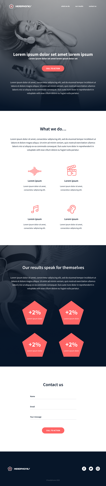

This a design implementation project using figma files.
A webpage is developed from scratch and the figma design files below used to generate a responsive webpage.
[figma design file for desktop screens](01_headphones_desktop@2x.png)
How the desktop version of the webpage will appear.
[Figma design file for mobile screens](01_headphones_mobile@2x.png)
The mobile version's appearance.

The tablet version's appearance.
The creation of the webpage is mainly through Html and Css code.